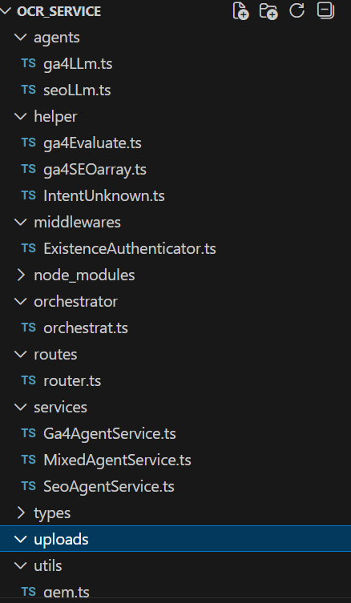
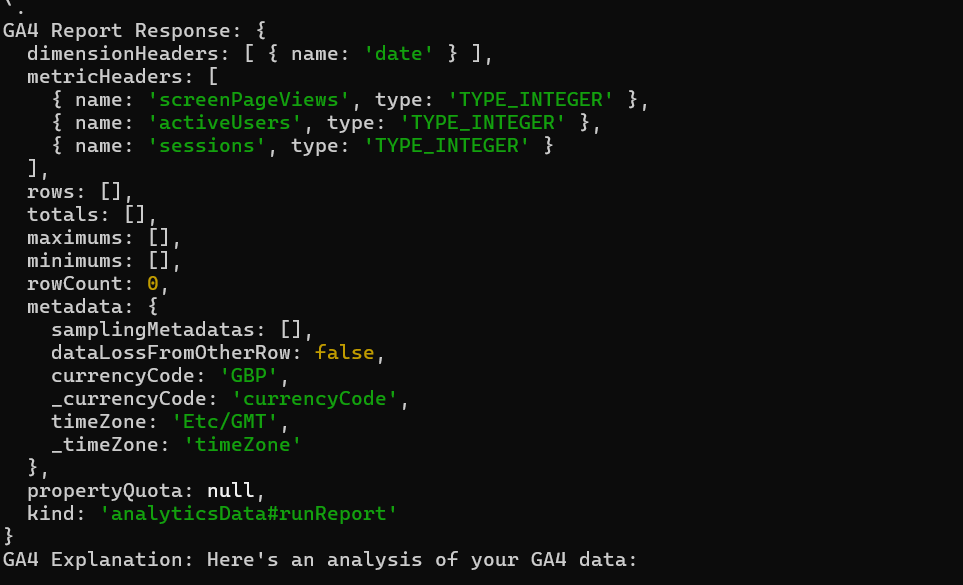
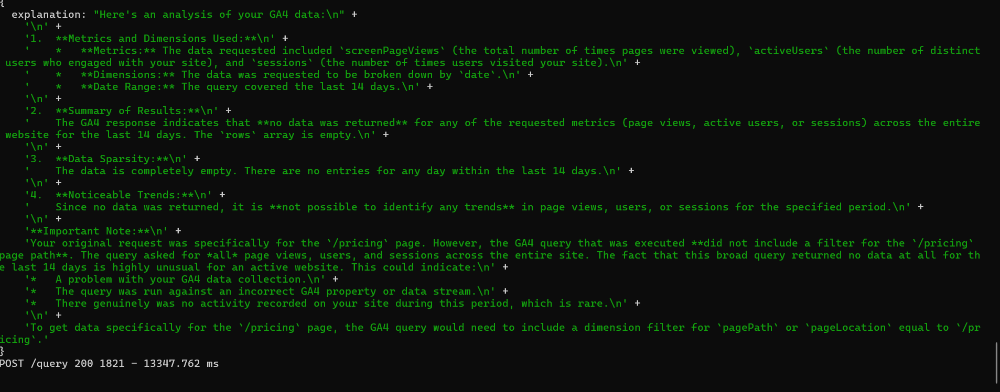
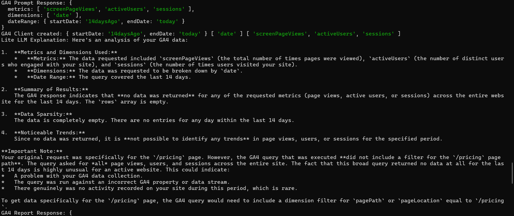
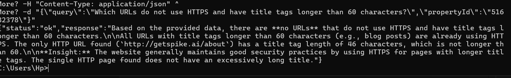

# Spike AI – Analytics & SEO Intelligence Service

## Overview
This project is an AI-powered analytics and SEO intelligence service built for the **Spike AI Builder Challenge**.

It exposes a single API endpoint that accepts **natural language queries** and intelligently routes them to the correct analysis pipeline using an **orchestrator-based architecture**.

The system combines:
- Google Analytics 4 (GA4) live data
- SEO audit data from Google Sheets
- LLM-based reasoning for structured insights

---

## High-Level Architecture

The architecture follows a **tiered agent model** with a central orchestrator.

---

## Architecture & Flow Diagrams

### 1. Overall System Architecture


### 2. Orchestrator Flow


### 3. GA4 Agent Pipeline


### 4. SEO Agent Pipeline


### 5. LLM Interaction & Reasoning


### 6. End-to-End Request Lifecycle


---

## Core Components

### 1. Orchestrator
- Single entry point for all queries
- Performs lightweight intent detection (`GA4`, `SEO`, `MIXED`)
- Routes requests to the appropriate agent
- Keeps business logic isolated from API and LLM layers

---
## Services
### 2. GA4 Agent (Tier-1)
- Designed for analytics-related queries
- Uses **Gemini LLM** to convert natural language into:
  - Metrics
  - Dimensions
  - Date ranges
- Fetches live data using **Google Analytics Data API**
- Passes raw data + original query to **LLM Lite** for reasoning and summarization

---

### 3. SEO Agent (Tier-2)
- Designed for SEO audit and technical SEO questions
- Reads structured SEO data from **Google Sheets** (Screaming Frog exports)
- Uses **Google Sheets API** to fetch tabular data
- Uses **LLM Lite** directly to:
  - Interpret the query
  - Filter relevant rows
  - Generate a human-readable explanation

---

### 4. LLM Lite
- Central reasoning engine
- Used by both GA4 and SEO agents
- Produces final natural language responses
- Does **not** fetch data; only reasons over provided inputs

---

### 5. Gemini LLM
- Used only in the GA4 pipeline
- Responsible for structured request generation
- Converts free-text queries into GA4-compatible parameters
- Not used for final reasoning or response generation

---
## ENV setup
PORT=8080
BASE_URL=http://3.110.18.218/
API_KEY=LLM API KEY
GEMINI_API_KEY=1ST KEY 
GEMINI_API_KEY2=2ND KEY
spreadsheetId="<SPREADSHEET ID>

## API Specification

### POST `/query`

#### Request Body
```json
{
  "query": "Which pages have low engagement in the last 14 days?",
  "propertyId": "516823782"
}

<p align="center">
  
</p>
<p align="center">
  
</p>
<p align="center">
  
</p>
<p align="center">
  
</p>
<p align="center">
  
</p>
<p align="center">
  
</p>
<p align="center">
  
</p>


